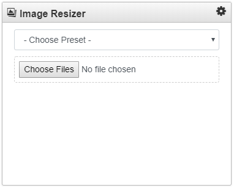
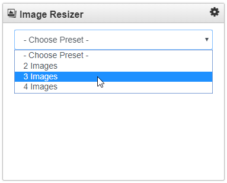
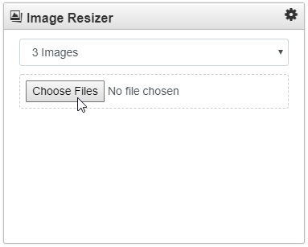
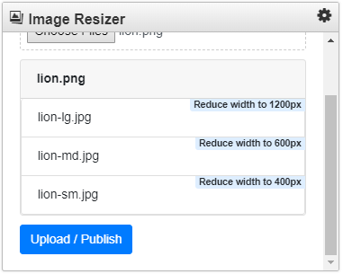
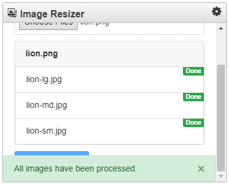
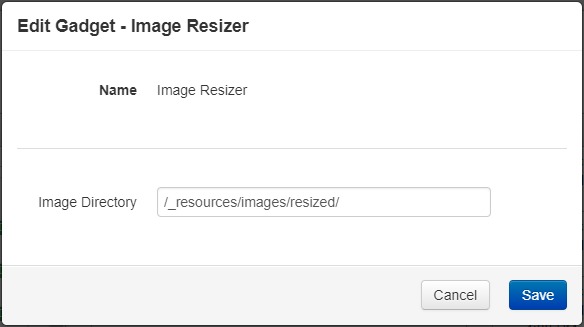
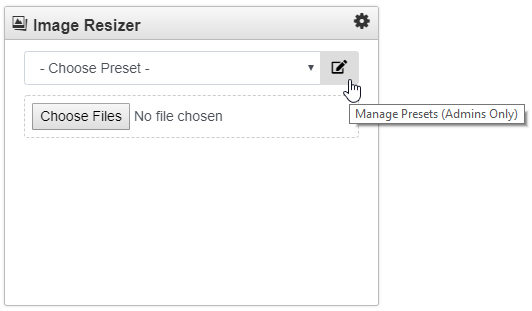
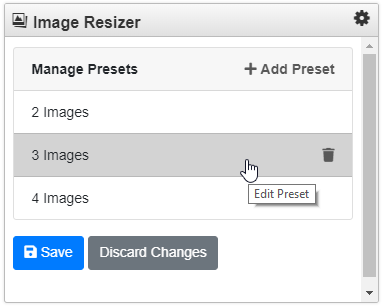
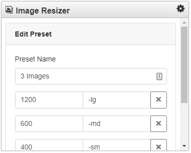
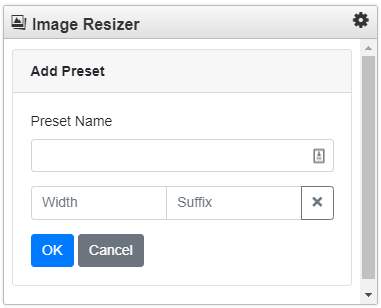

***The included source code, service and information is provided as is, and OmniUpdate makes no promises or guarantees about its use or misuse. The source code provided is recommended for advanced users and may not be compatible with all implementations of OU Campus.***

### Image Resizer Gadget
The Image Resizer is a custom gadget that scales down one or more images to specific resolutions based on presets managed by admin users. Then the files are uploaded to staging and published to production. The gadget can be used from the Dashboard or Sidebar.

#### How does it work?

First a Preset should be selected from the drop-down list. A preset specifies a set of widths and filename suffixes to be used to scale down the images and determine the filenames.

Then choose one or more images.

A summary of the images to be resized are displayed for each image uploaded. In this case, we selected a single image named lion.png.

The resized filenames are shown in the summary along with the new widths. Aspect ratios are preserved so only the width is needed to determine how the resolution will be changed.

Output images that already exist and ones that have a width preset that are larger than the source image width will be skipped. There will be an alert displayed on images that will not be processed. Also, the "Upload / Publish" button will only be displayed when at least one image is eligible for upload.

Then simply click "Upload / Publish” to start the process.

 Now the resized images have been uploaded to staging and published according to the root relative path set in the Image Directory field in the gadget settings.

#### How do administrators manage the Presets?

When logged in as an administrator there is a button to the right of the Preset drop-down list. The Presets are saved account wide.

The Manage Presets interface allows admin users to add, remove and edit Presets.

Click the trash can to remove a Preset.

Clicking on an existing Preset allows you to edit a Preset.

Clicking on Add Preset allows you to add a new one.

#### How do I get it?

Simply paste this URL in the Add Gadget modal: https://cdn.omniupdate.com/gadgets/image-resizer/v1/ and click Fetch.

Here you can specify who will have access to the gadget and specify the default root relative location where the images should be uploaded.

Note: Only level 6+ users have access to upload. So set access accordingly.