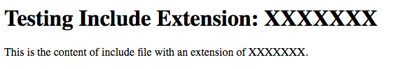

***The included source code, service and information is provided as is, and Modern Campus makes no promises or guarantees about its use or misuse. The source code provided is recommended for advanced users and may not be compatible with all implementations of Modern Campus CMS.***

# Include File Test
This tool allows you to do a zip import of files with certain include extensions to see if a server is configured correctly for a desired include setup. This tool does not provide any assistance in making server configurations, but is intended to be a reference to verify include file configurations on a server. 

## How to Use This Tool
 1. Zip import the included .zip file in this package to Modern Campus CMS (taking care that the Ignore Root Folder option is unchecked).
 2. Publish the `include-test` folder.
 3. Navigate to `include-test/table-of-contents.html` to see a list of pages with different extensions. These will be either `index` or `default` according to the server type followed by the extension of the page in parentheses. 
 4. Click on the desired file name/type to see what include file extensions render as includes in files with that extension. 
 5. You should see something like the following screen shot if the includes are setup correctly.
 
 6. If you do not see `This is the content of the include file with an extension of XXXXXXX` as shown above (where the include extension is shown instead of "XXXXXXX"), then contact whomever is responsible for server configurations so they can make changes that will allow for the desired includes on pages with the desired extension. 